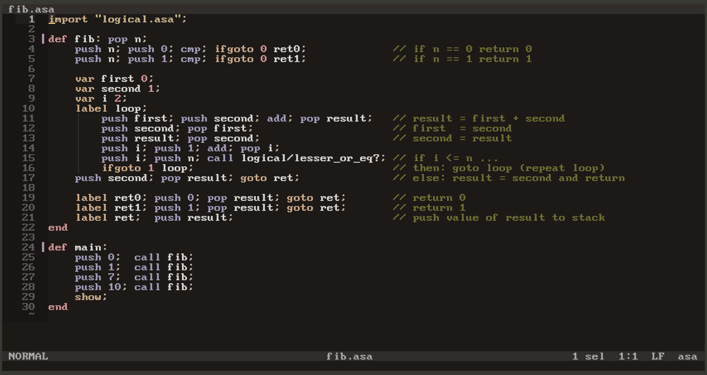

```
  aaaaaaaaaaaaa      ssssssssss     aaaaaaaaaaaaa
  a::::::::::::a   ss::::::::::s    a::::::::::::a
  aaaaaaaaa:::::ass:::::::::::::s   aaaaaaaaa:::::a
           a::::as::::::ssss:::::s           a::::a
    aaaaaaa:::::a s:::::s  ssssss     aaaaaaa:::::a
  aa::::::::::::a   s::::::s        aa::::::::::::a
 a::::aaaa::::::a      s::::::s    a::::aaaa::::::a
a::::a    a:::::assssss   s:::::s a::::a    a:::::a
a::::a    a:::::as:::::ssss::::::sa::::a    a:::::a
a:::::aaaa::::::as::::::::::::::s a:::::aaaa::::::a
 a::::::::::aa:::as:::::::::::ss   a::::::::::aa:::a
  aaaaaaaaaa  aaaa sssssssssss      aaaaaaaaaa  aaaa
```
> g++ version used: 13.2.0
> ⚠️ This whole virtual machine is currently being rewritten in C with A LOT of changes. Currently in design phase, but probably swapping to a register based vm rather than stack based. Also new IR and a looot of target possibilities. :3

# annotation
This is a toy project and should not be taken seriously, which means it is NOT for production at all. The goal of this project is to have fun!
I am not a C++ developer so keep that in mind but I will definitely clean up and refactor a lot :D

fyi: I have written a [tree-sitter grammar for asa](https://github.com/menaruben/tree-sitter-asa) to support
syntax highlighting for a better experience as I previously used a pascal mode in my editor to have some sort of highlighting. :)


```
Stack:
    Value: 55, Type: Integer
    Value: 13, Type: Integer
    Value: 1, Type: Integer
    Value: 0, Type: Integer
```
As we can see we successfully calculated `fib(0)`, `fib(1)`, `fib(7)` and `fib(10)`.

# Instructions / Keywords
The simplest and first function everyone writes when learning a new language is the classic "Hello World" example:
```pascal
def main:
  push "Hello World!"; println;
end
```
We define the entry point of the program by defining a `main` function. We then push the string "Hello World"
to the stack and call the instruction println. `println` prints the top of the stack to the terminal appending a new line at the end.
However if you don't want to append a newline you can just use the `print` instruction.

## Functions / Blocks
In asa you can define functions by using `def` and `end`. These functions are then called by using the
`call` instruction. Here is a quick example:
```pascal
def do_something:
  push "doing something...";
end

def main:
  call do_something;
  show;
end
```
The `main` function is the entrypoint of the program if we try to run it.

## Variables
In order to store something in a variable we usually `push` a value onto the stack and then `pop` it into a variable:
```pascal
def main:
  push 1; pop x; // x = 1
  push 2; pop x; // variables are mutable, therefore x = 2 now
  push x;        // we can also push the value of the variable to the stack
end
```

## Incrementing / Decrementing numbers
Instead of always needing to do `push x; push 1; add; pop x` to increment you can just use `incr` (increment) and `decr` (decrement)!

## Comparing data
Asa has a `cmp` instruction which takes the two top values of the stack and compares them:
```pascal
def main:
  push 1; push 2; cmp; // pushes -1 to stack because 1  < 2
  push 2; push 2; cmp; // pushes  0 to stack because 2 == 2
  push 3; push 2; cmp; // pushes  1 to stack because 3  > 2
end
```

## Labels + Goto (and Ifgoto) + Halt
Labels are used to mark a position in the program and Gotos are used to jump to the position. The following program pushes 1 to the stack until we get
a stack overflow:
```pascal
def main:
  label loop;
  push 1;
  goto loop;
end
```
Loops can also be used to skip a portion of code.
```pascal
def main:
  push 21; pop age;
  push 18; push age; cmp; pop 18_to_age;  // 18 < 21 <=> 18_to_age = -1

  // if 18 <= age then goto over_18
  push 18_to_age; ifgoto -1 over_18;
  push 18_to_age; ifgoto 0 over_18;

  // otherwise do this and goto return:
  push "not allowed to drink"; pop verdict;
  goto return; // skips the over_18 body

  label over_18;
    push "allowed to drink"; pop verdict;
    goto return; // not really needed here since it is the next instruction anyways...

  label return;
    push verdict;

  show;
end
```

## Math Operations
In asa there are `add`, `sub`, `mul`, `div`, `lshift` and `rshift`. The
```pascal
def main:
  // evaluate (3*5 + 1)/4 - 3 = 1
  push 3; push 5; mul;   // 3 * 5  = 15
  push 1; add;           // 15 + 1 = 16
  push 4; div;           // 16 / 4 =  4
  push 3; sub;           // 4 - 3  =  1
  println;
  push 8; push 2; lshift; println; // 8 << 2
  push 8; push 2; rshift; println; // 8 >> 2
end
```
```
1
32
2
```

## Types
Asa has a few types:
- Double
- BigDouble
- Integer
- BigInteger
- Float
- String
- Char

You can get the type of the element on top of the stack by using the `type` instruction :
```pascal
def main:
  push 1;              type; println; // Integer
  push 2147483650bi;   type; println; // BigInteger
  push .078f;          type; println; // Float
  push 3.14f;          type; println; // Double
  push 2.71828bd;      type; println; // BigDouble
  push "Hello World!"; type; println; // String
  push true;           type; println; // Boolean
  push false;          type; println; // Boolean
  push 'a';            type; println; // Char
end
```
```
Integer
BigInteger
Float
Float
BigDouble
String
Bool
Bool
Char
```

## Importing
asa also allows us to modularize our code because it supports `import` statements. Let's say that we have the following file (in the same directory):
> stringlib.asa:
```pascal
def concat:
  pop b; pop a;
  push a; push b; add;
end
```
We can import `stringlib.asa` into our code by using `import`:
```pascal
import "stringlib.asa";

def main:
  push "Hi"; push " ruby!";
  call stringlib/concat; // adds namespace "stringlib"
  show;
end
```
The result of this code correctly shows `"Hi ruby!"` in the stack. As we can see, asa also has namespaces. Let's assume we want to write a
`greet` function. We can import `stringlib.asa` and define the `greet` as follows:
> greeting.asa:
```pascal
import "stringlib.asa";

def greet:
  pop name;
  push "Hello "; push name; call stringlib/concat;
end
```
We can then import the `greeting.asa` and use the `greeting/greet` function and the `stringlib/concat` function:
> main.asa
```pascal
import "greeting.asa";

def main:
  push "ruby"; call greeting/greet;
  push "a"; push b; call stringlib/concat;
  show;
end
```
```
Stack:
    Value: "ab", Type: String
    Value: "Hello ruby", Type: String
```

If you are developing libraries and your functions depend on functions inside the own
namespace you still must use the namespace infront of the identifier. One example would be the `even?` function
in the [`math.asa`](./src/stdlib/math.asa). It uses the `modulo` function from the same namespace but it still
has to use the full identifier `math/modulo` instead of just `modulo`.

# stdlib
The stdlib is work in progress and can be found [here](./src/stdlib/)

# Contributing
If you are interested in expanding asa you can find some useful information [here](./src/README.md).
